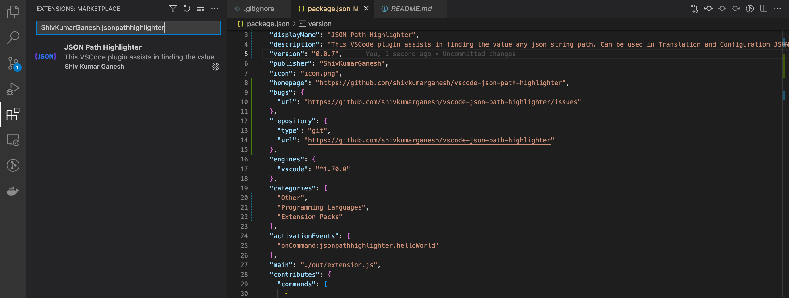

# JSON Path Highlighter

## Introduction
JSON Path highlighter is a command based extension and is intended to find various sequence of strings from a JSON file. This is mostly targetted towards configuration or translation files. Provided a string path this extension gets the value that exists on that path and shows in a success banner.

## Installation

### Installing from the website
Inorder to install the plugin. Please visit the below mentioned URL and Click install.
[Click to install JSON Path Highlighter](https://marketplace.visualstudio.com/items?itemName=ShivKumarGanesh.jsonpathhighlighter)

### Installing from the Extension menue in VS-Code
Go to the extesnions section on VS-Code and search for `ShivKumarGanesh.jsonpathhighlighter` or JSON Path Highlighter. This will help you the find the plugin. Searching for `ShivKumarGanesh.jsonpathhighlighter` for sure will help you to find the plugin easily.

## Usage

## Usage Video

## Implementation Plan